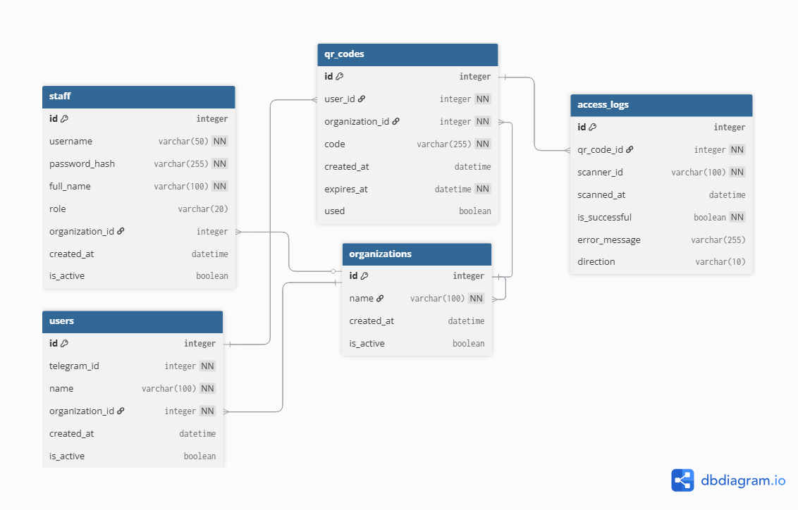

# Приложение для современной системы безопасности в государственных учереждениях

## Описание проекта

**Safe Team** — наша команда представляет современную систему контроля и управления доступом (СКУД), основанная на технологии динамических QR-кодов. Проект обеспечивает безопасную и удобную авторизацию сотрудников и посетителей без использования физических пропусков.

### Ключевые возможности:
*   🔄 **Динамические QR-коды:** Генерация уникальных пропусков, которые автоматически обновляются и имеют ограниченный срок действия, исключая возможность копирования или передачи третьим лицам.
*   🤖 **Telegram-бот:** Удобный интерфейс для пользователей — получение пропуска, просмотр статуса и регистрация прямо в мессенджере.
*   🏢 **Веб-портал охраны:** Инструмент для сотрудников службы безопасности, позволяющий сканировать коды в реальном времени и вести учет посещений.
*   🛡️ **Безопасность:** Полная защита данных с использованием JWT-авторизации и хеширования. Все действия логируются.
*   ⚡ **High Performance:** Асинхронная архитектура на базе **FastAPI** и **SQLAlchemy** обеспечивает высокую скорость обработки запросов даже при большой нагрузке.

## Стек технологий

### Основное
*   **[FastAPI](https://fastapi.tiangolo.com/)** (0.104.1) — высокопроизводительный асинхронный веб-фреймворк.
*   **[SQLAlchemy](https://www.sqlalchemy.org/)** (2.0.23) — мощная ORM для работы с базами данных.
*   **[aiosqlite](https://aiosqlite.omnilib.dev/en/stable/)** (0.19.0) — асинхронный драйвер для SQLite.
*   **[Pydantic](https://docs.pydantic.dev/)** (2.5.0) — валидация данных и управление схемами.
*   **[Uvicorn](https://www.uvicorn.org/)** (0.24.0) — ASGI сервер.

### Telegram Бот
*   **[python-telegram-bot](https://python-telegram-bot.org/)** (22.5) — библиотека для создания Telegram-ботов.
*   **[httpx](https://www.python-httpx.org/)** (0.28.1) — современный асинхронный HTTP-клиент.

### Безопасность
*   **[Passlib](https://passlib.readthedocs.io/)** — хеширование паролей (bcrypt).
*   **[Python-Jose](https://python-jose.readthedocs.io/)** — работа с JWT токенами и криптографией.

### QR-коды
*   **[qrcode](https://github.com/lincolnloop/python-qrcode)** (8.2) — генерация QR-кодов.
*   **[Pillow](https://python-pillow.org/)** (12.0.0) — обработка изображений.

### Инструменты
*   **[Alembic](https://alembic.sqlalchemy.org/)** — управление миграциями базы данных.
*   **[Docker](https://www.docker.com/)** — контейнеризация приложения.
*   **[Ruff](https://docs.astral.sh/ruff/)** — быстрый линтер и форматтер кода.
*   **[Pytest](https://docs.pytest.org/)** — фреймворк для тестирования.

## Зависимости

### Зависимости для деплоя
docker>=27.0.0

### Зависимости для разработчика
Для установки зависимостей разработчика в командной строке пропишите команды
```bash
make setup
```

## Руководство по запуску (для деплоя сервера)
Установите [зависимости для деплоя]()

Склонируйте Github репозиторий командой, перейдите в папку проекта и соберите докер-контейнеры:
```bash
git clone https://github.com/SOKLY6/Project_safe_team.git
cd Project_safe_team
docker compose up --build
```

## Руководство по запуску (для разработчика)
Склонируйте Github репозиторий командой, перейдите в папку проекта:
```bash
git clone https://github.com/SOKLY6/Project_safe_team.git
cd Project_safe_team
sudo apt update
sudo apt install curl unzip -y
echo 'export PATH="$HOME/.local/bin:$PATH"' >> ~/.bashrc
source ~/.bashrc
```

Установите [зависимости для разработчика]()

Активируйте виртуальное окружение
```bash
source .venv/bin/activate
```

### Запуск сервера uvicorn:
```bash
make runserver
```

### Запуск сайта:
```bash
make runhttp
```

### Запуск телеграм бота:
```bash
make runbot
```

# Структура проекта
```
qr-access-system/
├── alembic/
│   └── versions/
|
├── app/
│   ├── api/
│   │   ├── auth.py
│   │   ├── organization.py
│   │   ├── qr_code.py
│   │   ├── scanner.py
│   │   ├── staff.py
│   │   └── users.py
│   ├── models/
│   │   ├── access_log.py
│   │   ├── organization.py
│   │   ├── qr_code.py
│   │   ├── staff.py
│   │   └── user.py
│   ├── schemas/
│   │   ├── access_log.py
│   │   ├── organization.py
│   │   ├── qr_code.py
│   │   ├── staff.py
│   │   └── user.py
│   ├── services/
│   │   ├── auth.py
│   │   ├── cache_service.py
│   │   ├── cleanup_service.py
│   │   ├── dependencies.py
│   │   ├── qr_service.py
│   │   ├── scanner_service.py
│   │   └── verification_service.py
│   ├── utils/
│   │   └── logger.py
│   ├── config.py
│   ├── database.py
│   └── main.py
|
├── telegram_bot/
│   ├── handlers/
│   │   ├── common.py
│   │   └── start.py
│   ├── keyboards/
│   │   └── main_menu.py
│   ├── services/
│   │   ├── api_client.py
│   │   └── utils.py
│   ├── config.py
│   ├── Dockerfile
│   └── main.py
|
├── test/
│   └── unit_test/
|
├── web_portal/
│   ├── css/
│   │   ├── qr-result.css
│   │   └── style.css
│   ├── js/
│   │   ├── api.js
│   │   ├── auth.js
│   │   ├── auth-utils.js
│   │   └── scan_qr.js
│   ├── index.html
│   ├── login.html
│   └── scan_qr.html
|
├── .env.example
├── .gitignore
├── .pre-commit-config.yaml
├── .python-version
├── alembic.ini
├── create_admin.py
├── docker-compose.yml
├── Dockerfile
├── Makefile
├── pyproject.toml
├── README.md
└── uv.lock
```

## Структура базы данных проекта



## Информация
[Сервер uvicorn]() будет доступен по адресу: http://localhost:8000. 
[Сайт]() будет доступен по адресу: http://localhost:8001/
